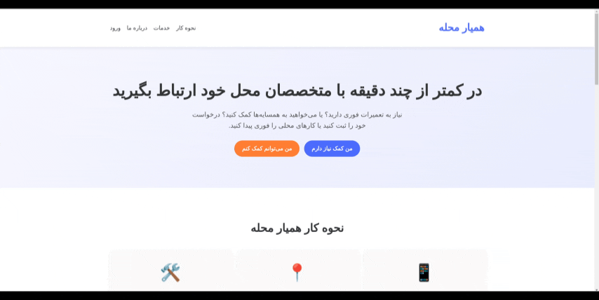

# 🧱 Divar Neighbors – Smart Local Service Add-on

**Divar Neighbors** is a smart add-on for the Divar platform designed to connect service requesters with nearby specialists based on their **location** and **skillset**.

---

## 📌 Project Idea

Imagine the electricity in your house goes out and you urgently need an electrician. Instead of searching online or making multiple calls, you simply post a request through Divar. Our system will automatically notify nearby electricians who can respond, connect, and help you directly.

This tool aims to speed up and localize service-based connections on the Divar platform — fast, relevant, and location-aware.

---

## ⚙️ How It Works

### For Service Providers (those posting service ads):
- A **new add-on button** appears in the "Service Ads" section of Divar.
- Clicking it leads to a page where the user can:
  - Select their city and neighborhood (e.g., Tehran, Tajrish)
  - Choose the exact location via a map (using frontend geolocation)
  - Submit the information via a button

### For Service Seekers (those needing a technician):
- On the Divar home page, click **Local Services**.
- You’ll be redirected to a new page with service categories like:
  - Refrigerator repair
  - Water heater repair
  - Air conditioner repair
- After selecting a service, a form will appear to collect:
  - Full name
  - City, neighborhood, full address
  - Exact location via map
- Clicking **Search for a Technician** will:
  - Automatically scan the area for available professionals
  - Send requests to matching service providers
  - If a provider accepts, both parties will be connected:
    - A chat screen is shown
    - Phone numbers are shared for direct contact

> If no providers are found in the selected area, a message will show:  
> “No technician found in the selected location.”

---

## 🎥 Demo (PDF,GIF)

Here’s a visual preview of how Divar Neighbors works:
📄 [View Full PDF DEMO](assets/kenardivar-project.pdf)



---

## 🛠 Technologies Used

| Tool | Purpose |
|------|---------|
| **Django REST Framework** | Backend API development |
| **Divar APIs** | Integration with existing ad listings |
| **Ngrok** | Expose localhost for external access and testing |
| **Geopy** | Location and distance calculations |
| **Frontend Map (Leaflet or Google Maps)** | Location selection via map coordinates |

---

## 📦 Installation & Setup

1. **Clone the repository**:
```bash
git clone https://github.com/Divar-Neighbors/divar-neighbor.git
cd divar-neighbor

Create and activate a virtual environment:

bash
Copy
Edit
python -m venv venv
source venv/bin/activate  # For Windows: venv\Scripts\activate
Install required dependencies:

bash
Copy
Edit
pip install -r requirements.txt
Run the local development server:

bash
Copy
Edit
python manage.py runserver
Expose your localhost using ngrok:

bash
Copy
Edit
ngrok http 8000
You’ll get a public URL (e.g., https://xyz.ngrok.io) that you can use for external testing and API integration.
